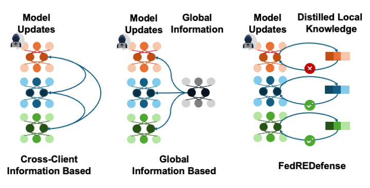

# FedREDefense
The official code for ICML 2024 "[FedREDefense: Defending against Model Poisoning Attacks for Federated Learning using Model Update Reconstruction Error](https://proceedings.mlr.press/v235/xie24c.html)"

## $\color{red}{\text{Erratum: Table 8}}$

We identified a type error in the **FashionMNIST / Min-Max / FLTrust** row of Table 8. The corrected results, obtained from a new 500-round run with seed 4, are provided below.

| Metric | Originally reported | Corrected result (new run) |
|---|---:|---:|
| ADACC (%) | 87.03 | 66.43 |
| AFPR (%) | 18.01 | 20.80 |
| AFNR (%) | 67.40 | 66.40 |
| AAR (rounds) | 337.00 | 332.00 |

We apologize for the error and any confusion it may have caused.

## Overview
Federated Learning (FL) faces threats from model poisoning attacks. 
Existing defenses, typically relying on cross-client/global information to mitigate these attacks, fall short when faced with non-IID data distributions and/or a large number of malicious clients.
To address these challenges, we present FedREDefense. Unlike existing methods, it doesn't hinge on similar distributions across clients or a predominant presence of benign clients. 
Instead, it assesses the likelihood that a client's model update is a product of genuine training, solely based on the characteristics of the model update itself.
Our key finding is that model updates stemming from genuine training can be approximately reconstructed with some distilled local knowledge, while those from deliberate handcrafted model poisoning attacks cannot.
Drawing on this distinction, FedREDefense identifies and filters out malicious clients based on the discrepancies in their model update \textbf{R}econstruction \textbf{E}rrors. 
Empirical tests on three benchmark datasets confirm that FedREDefense successfully filters model poisoning attacks in FL—even in scenarios with high non-IID degrees and large numbers of malicious clients.

## Quick Start
Evaluate FedREDefense on three datasets:
> bash ./scripts/cifar10/ours.sh

> bash ./scripts/cinic/ours.sh

> bash ./scripts/FashionMNIST/ours.sh

## Acknowledgement
We would like to give credit to the following repositories for their code and resources that we used in our project:

- [DYNAFED: Tackling Client Data Heterogeneity with Global Dynamics](https://github.com/pipilurj/DynaFed)
- [Dataset Distillation by Matching Training Trajectories
](https://github.com/GeorgeCazenavette/mtt-distillation) 
